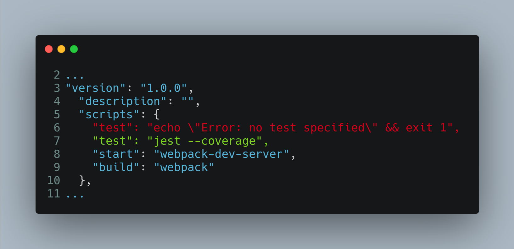

# Javascript Vanilla: SPA

Aplicación sencilla para obtener usuarios de un API REST pública. Incluye pruebas unitarias.

### Requerimientos:

*  [Node.js](https://nodejs.org/en/download/)

### Empezar:

El código base para este ejemplo lo encuentra en la rama `master` del repositorio [Webpack Starter](https://github.com/suga0828/webpack-starter). En las imágenes de los pasos siguientes el texto rojo y verde se refieren a código eliminado o agregado, respectivamente.

1. Descargue el repositorio e instale la dependencias ejecutando:

```bash
  git clone https://github.com/suga0828/webpack-starter.git
  cd webpack-starter
  npm install
```

2. Elimine la carpeta `examples/`.

3. Agregue un contenedor para la aplicación y el favicon. Edite el archivo `src/index.html`.


4. Cree el archivo `src/App.ts`


5. Renombre el archivo `src/main.tsx` por `src/main.ts` y modifiquelo de la siguiente manera.


6. Cambie la configuración de Webpack para ajustar el entrypoint. Modifique el archivo `webpack.config.js`.


7. Ejecute la aplicación. [http:localhost:9999](http:localhost:9999):

```bash
  npm run start
```

8. **OPTIONAL**: Cree una interface para agregar tipo a los usuarios. Cree el archivo `src/api/api.model.ts`.


9. Cree el archivo del servicio para hacer las peticiones HTTP al API REST [JSONPlaceholder](https://jsonplaceholder.typicode.com/). Cree el archivo `src/api/api.service.ts`. Si evitó el paso anterior debe borrar el import y sustituir `User` por `any`.


10. Cree el componente para obtener e imprimir los usuarios. Cree el archivo `src/components/ListUsers.ts`. Si evitó el paso 8 debe borrar el import y sustituir `User` por `any`.


11. Agregue el componente ListUsers a la aplicación. Edite el archivo `src/App.ts`:


12. Instale las deperencias para usar [Jest](https://jestjs.io/):

```bash
  npm install --saveDev @babel/core @babel/preset-env @babel/preset-typescript @types/jest babel-jest jest
```

13. Agregue la configuración de [Babel](https://babeljs.io/) (compila código Typescript para que Jest ejecute las pruebas). Cree el archivo `babel.config.js`:


14. Agregue un comando para ejecutar los tests. Modifique el archivo `package.json`:



15. Cree las pruebas unitarias del componente **ListUsers**. Cree el archivo `src/components/ListUsers.test.ts`:


16. Excluya los archivos de covertura generados. Modifique el archivo `.gitignore`:


### Development:
Run the following command for development:
```
$ npm run start
```
### Deployment:
Run the following command for production. The output code is placed in `dist/` folder.
```
$ npm run build
```
### Test:
Run the following command for run testing. The coverage output code is placed in `coverage/lcov-report/index.html` folder.

```
$ npm run test --coverage
```
